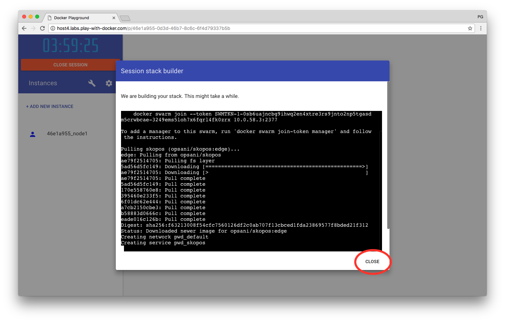
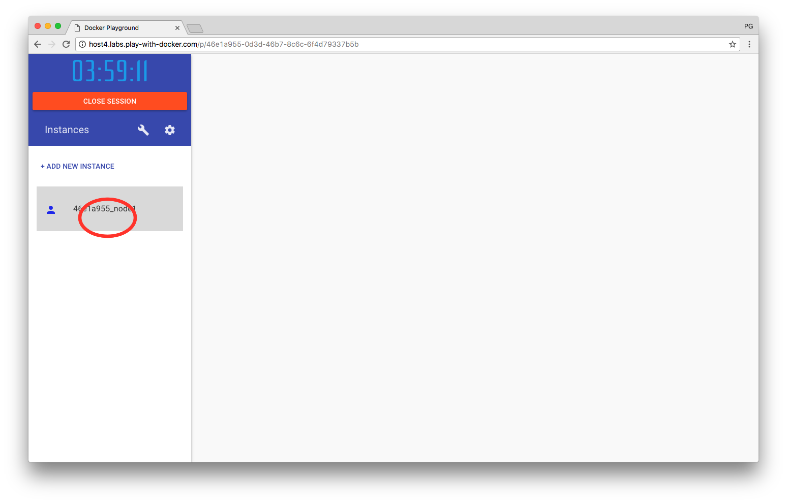
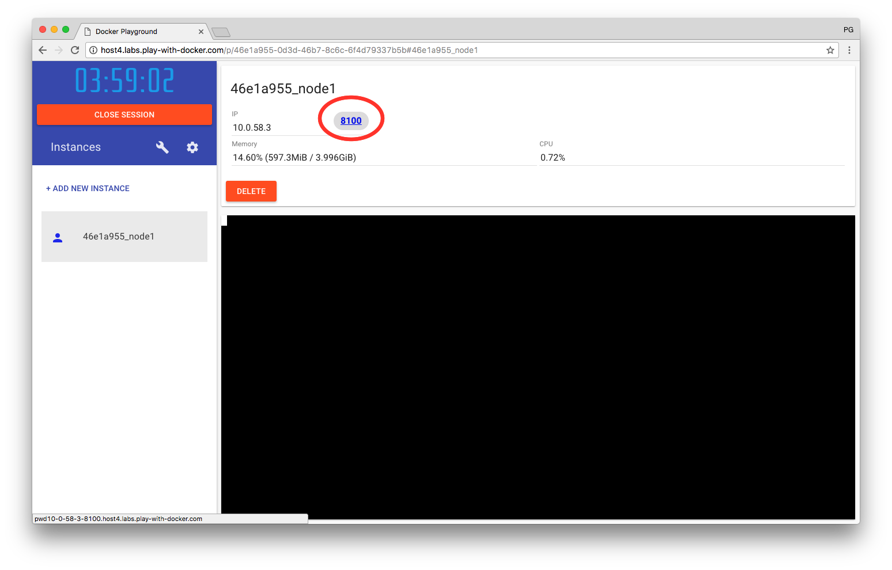
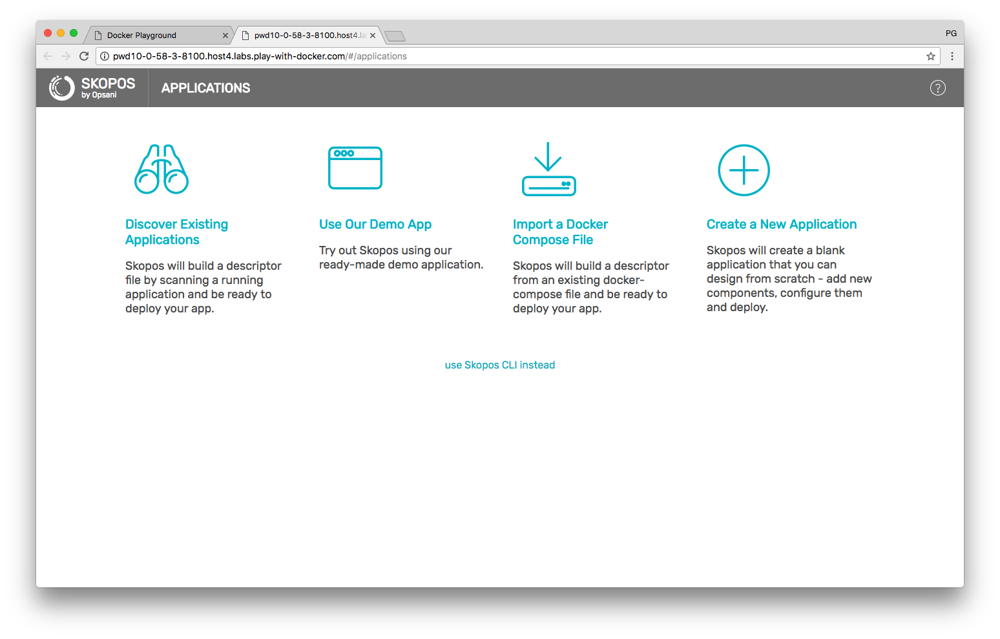

# Skopos On PWD
PWD ([play-with-docker](http://play-with-docker.com/)) is a free online tool that gives you a playground to build and run Docker containers without the need to install anything on your infrastructure.

This repository contains the docker compose file, as well as the instructions on how to run [Skopos](http://opsani.com/skopos/) on PWD.

To run Skopos on PWD:

 - Go to Skopos' PWD 

 - Wait for the stack to be initialized (may take a few seconds) and close the "Session Stack Builder" popup window

 - Select the cluster node on the left side of the screen

 - Click on the "8100" link that will take you to the Skopos GUI (exposed on port 8100)

 - You now have an instance of Skopos running on PWD. Please check [Skopos' docs](http://doc.opsani.com/skopos/edge/GET-STARTED/#new-user-workflows) for details on how to use SKopos.

 
